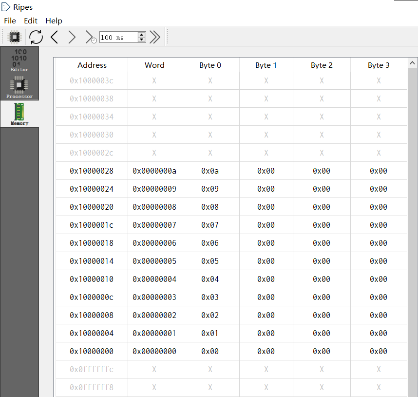
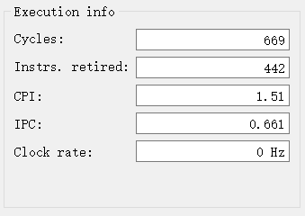

# 计算机组成原理 实验报告

**姓名：** Ouedraogo Ezekiel B. **学号:** PL19215001 **实验日期** 08/04/2021

## 一、实验题目

基于RV32IM汇编的冒泡排序程序

## 二、实验目的

* 基于RV32IM汇编，设计一个冒泡排序程序，并用Ripes工具调试执行。
* 测量冒泡排序程序的执行时间。

## 三、实验平台

[Ripes](https://github.com/mortbopet/Ripes)

## 四、实验过程

我们本次实验就按下面C语言冒泡排序来实现的。

```c
void bubbleSort(int *array, int size) {
    for(int* i = array; i < array+size; i++) {
        for(int *j = i+1; j < array+size; j++) {
            if(*i > *j){
                int tmp = *i;
                *i = *j;
                *j = tmp;
            }
        }
    }
}
```

我们将把要排序的数组地址放在寄存器```X10```，数组的大小放在```X11```

```nasm
bubbleSort:
	# x10 = array, x11 = size
	slli x11, x11, 2    # size = size * 4
	add x12, x10, x11   # x12 = &array[size]
	
	# from now (i and j are pointers)
    # x10 = i, x11 = j, x12 = &array[size]
loop1:
	bge x10, x12, exit1  # check i still in range

	addi x11, x10, 4         # j = i + 1

	addi sp, sp, -8          # stake : make room for 2 items
	sw x5, 4(sp)	         # save x5 on stack
	sw x6, 0(sp)	         # save x6 on stack
                             # x5 and x6 will be used inside loop2

loop2:

	bge x11, x12, exit2  # check j still in range

	lw x5, 0(x10)        # load i value
	lw x6, 0(x11)    	 # load j value
	ble x5, x6, exit3    # exit if *i <= *j
                         # else swap
	sw x6, 0(x10)
	sw x5, 0(x11)

exit3:
	addi x11, x11, 4    # j++
	jal loop2           # recursive call

exit2:
	lw x6, 0(sp)        # restore x6 from stack
	lw x5, 4(sp)        # restore x5 from stack
	addi sp, sp, 8      # restore stack pointer

	addi x10, x10, 4    # i++
	jal loop1           # recursive call

exit1:
	jalr x1  # return to calling routine
```

## 五、实验结果

```nasm
.data
	array:  .word 2,4,6,8,0,9,7,5,3,1
	size:	.word 10
```

利用上面的数据测试的结果如下：

* 排序前

* 排序后


### 执行时间



## 六、心得体会

在本次实验中了解到了很多关于RISC V 汇编语言的语法，还了解了CPU的基本操作。
