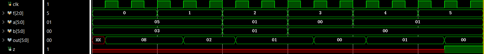
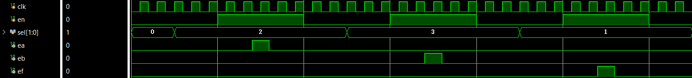
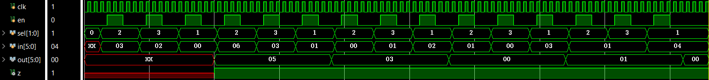
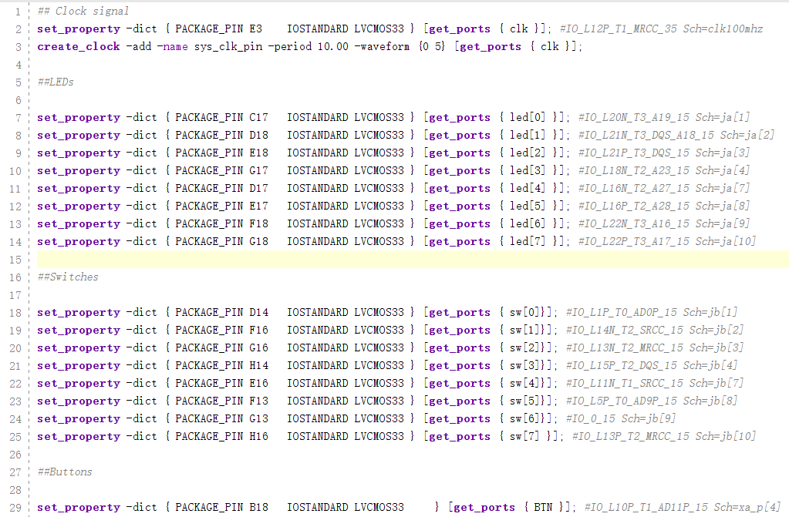
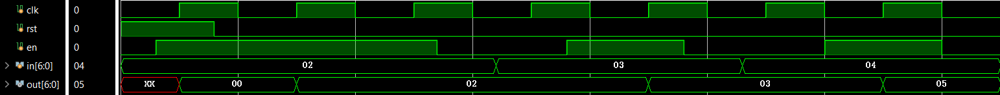

# 计算机组成原理实验 报告

## 实验题目：运算器及其应用

## 学生姓名：Ouedraogo Ezekiel B

## 学生学号：PL19215001

---

### 实验目的

---

掌握算术逻辑单元 (ALU) 的功能

掌握数据通路和控制器的设计方法

掌握组合电路和时序电路，以及参数化和结构化的Verilog描述方法

了解查看电路性能和资源使用情况

---

### 实验环境

---

[Online FPGA](https://fpgaol.ustc.edu.cn)

Vivado

---

### 实验步骤

---

1. ALU模块的逻辑设计和仿真

首先建立一个带ALU基本功能（加法，减法，等）的一个模块

f | out | z
--- | --- | ---
000 | a + b | *
001 | a - b | *
010 | a & b | *
011 | a \| b | *
100 | a ^ b | *
其他 | 0 | 1

```verilog
module ALU #(parameter MSB = 31, LSB = 0, F_MSB = 2, F_LSB = 0) (
    input clk,
    input [MSB:LSB] a, b, 
    input [F_MSB:F_LSB] f,   
    output reg [MSB:LSB] out,
    output reg z
    );
    parameter ADD = 0;
    parameter SUB = 1;
    parameter AND = 2;
    parameter OR  = 3;
    parameter XOR = 4;

    always @(posedge clk) begin
        case (f)
            ADD: out <= a+b;
            SUB: out <= a-b;
            AND: out <= a&b;
            OR: out <= a|b;
            XOR: out <= a^b;
            default: begin
                out <= 0;
                z <= 1;
            end
        endcase
    end
endmodule
```



因为要分时输入 f, a 和 b 再建立建立一个模块控制

sel | ef | eb | ea
--- | --- | --- | ---
00 | 0 | 0 | 0
01 | 1 | 0 | 0
10 | 0 | 1 | 0
11 | 0 | 0 | 1

```verilog
module Decoder (
    input clk, en,
    input [1:0] sel,
    output reg ea, eb, ef
    );
    
    parameter NONE = 0;
    parameter F = 1;
    parameter A = 2;
    parameter B = 3;

    always @(negedge clk) begin //use negedge cause btn_edge is using posedege
        if(btn_edge) begin
            case (sel)
                NONE: begin
                    ef <= 0; ea <= 0; eb <= 0;
                end
                F: begin
                    ef <= 1;
                end
                A: begin
                    ea <= 1;
                end
                B: begin
                    eb <= 1;
                end
            endcase
        end
        else begin
            ef <= 0; ea <= 0; eb <= 0;
        end
    end

    signal_edge signal_edge(
    .clk(clk),
    .in(en),
    .out(btn_edge)
    );
endmodule

module signal_edge #(parameter MSB = 0, LSB = 0) (
    input clk,
    input[MSB:LSB]  in,
    output reg [MSB:LSB] out
    );
    reg [MSB:LSB] s1,s2;
    always@(posedge clk) s1 <= in;
    always@(posedge clk) s2 <= s1;
    always @(posedge clk) begin
        if(s1 == s2) 
            out <= 0;
        else 
            out <= s1;
    end
endmodule
```



利用Control模块来控制上面的功能

```verilog
module Control #(parameter MSB = 31, LSB = 0, F_MSB = 2, F_LSB = 0) (
    input clk, en,
    input [1:0] sel,
    input [MSB:LSB] in,
    output reg [MSB:LSB] out,
    output reg z
    );
    wire ea,eb,ef;
    wire [MSB:LSB] a, b, ALU_out, ALU_z;
    wire [F_MSB:F_LSB] f;

    always @(negedge clk) begin //use negedge cause ef_edge is using posedege
        if(ef_edge) begin 
            out <= ALU_out;
            z <= ALU_z;
        end
    end

    signal_edge signal_edge(
    .clk(clk),
    .in(ef),
    .out(ef_edge)
    );

    ALU  #(.MSB(MSB),.LSB(LSB)) ALU(
    .clk(clk),
    .a(a), .b(b), 
    .f(f),   
    .out(ALU_out),
    .z(ALU_z) 
    );

    Decoder Decoder(
        .clk(clk),
        .en(en),
        .sel(sel),
        .ea(ea), .eb(eb), .ef(ef)
        );
    
    REG #(.MSB(MSB),.LSB(LSB)) A(
        .clk(clk),
        .en(ea),
        .in(in),
        .out(a)
        );

    REG #(.MSB(MSB),.LSB(LSB)) B(
        .clk(clk),
        .en(eb),
        .in(in),
        .out(b)
        );

    REG #(.MSB(F_MSB),.LSB(F_LSB)) F(
        .clk(clk),
        .en(ef),
        .in(in),
        .out(f)
        );
endmodule

module REG #(parameter MSB = 31, LSB = 0) (
    input clk, en,
    input [MSB:LSB] in,
    output reg [MSB:LSB] out
    );

    always @(posedge clk)
        if(en) out <= in;
endmodule
```



现在可以用FPGAOL测试

```verilog

module FPGA (
    input clk, BTN,
    input [7:0] sw,
    output [7:0] led
    );

    Control #(.MSB(5)) Control (
    .clk(clk), .en(BTN),
    .sel(sw[7:6]),
    .in(sw[5:0]),
    .out(led[5:0]),
    .z(led[7])
    );
endmodule
```



2. Fibonacci

```verilog
module FPGA (
    input clk, BTN, 
    input [7:0] sw,
    output [7:0] led
    );
    Fibonacci Fibonacci(
        .clk(clk), .rst(sw[7]), .en(BTN),
        .in(sw[6:0]),
        .out(led[6:0])
    );
endmodule

module Fibonacci #(parameter MSB = 6, LSB = 0) (
    input clk, rst, en,
    input [MSB:LSB] in,
    output reg [MSB:LSB] out
    );
    reg done;
    reg [1:0] count;
    reg [MSB:LSB] prev;

    always @(posedge clk) begin
        if(rst) begin
            out <= 0;
            prev <= 0;
            count <= 0;
            done <= 0;
        end
        else if(en == 1) begin
            if(done == 0) begin 
                done <= 1;
                prev <= out;
                if(count < 2) begin
                    out <= in;
                    count = count + 1;
                end
                else begin
                    out <= out + prev;
                end
            end
        end
        else begin
            done <= 0;
        end
    end
endmodule
```


