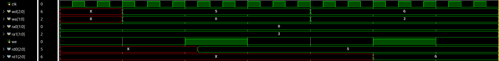
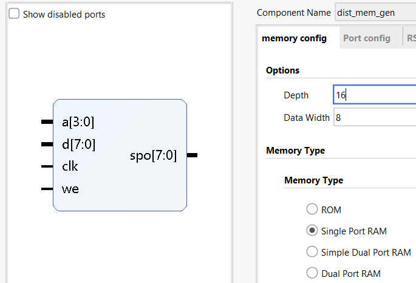
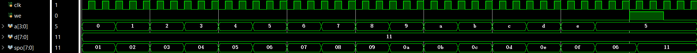
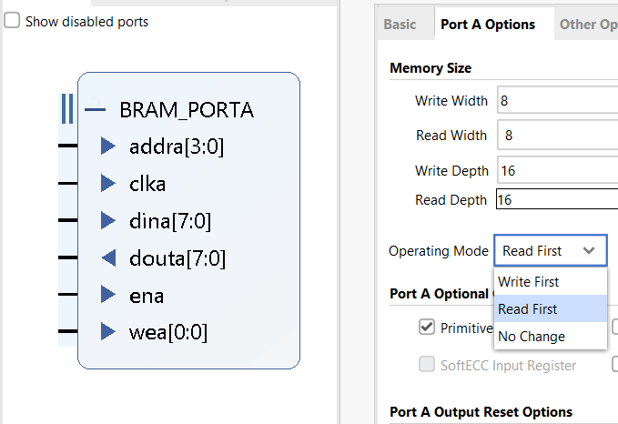
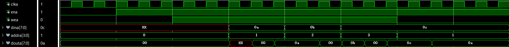
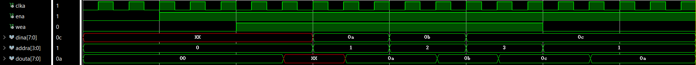
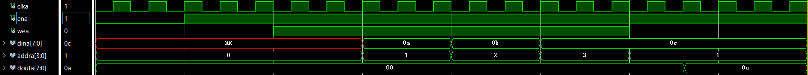
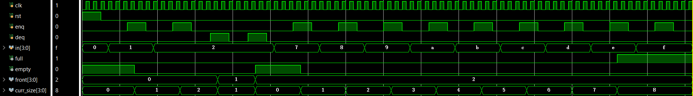
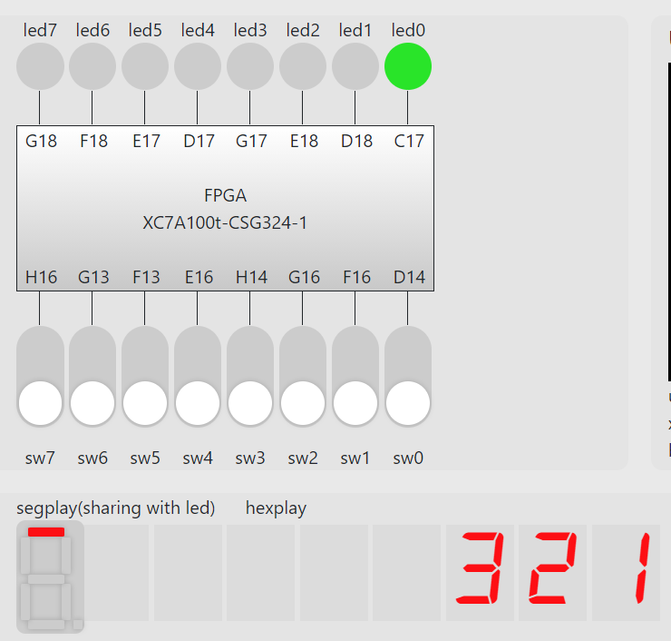

# 计算机组成原理实验 报告

## 实验题目：寄存器堆与存储器及其应用

## 学生姓名：Ouedraogo Ezekiel B

## 学生学号：PL19215001

---

### 实验目的

---

* 掌握寄存器堆（Register File）和存储器的功能、时序及其应用

* 熟练掌握数据通路和控制器的设计和描述方法

---

### 实验环境

---

[Online FPGA](https://fpgaol.ustc.edu.cn)

Vivado

---

### 实验步骤

---

I. 寄存器堆

```verilog
module RegFile #(parameter A_MSB = 31, D_MSB = 31, A_LSB = 0, D_LSB = 0) (
    input clk, we,                    // write enable
    input [D_MSB:D_LSB] wd,           // write data
    input [A_MSB:A_LSB] wa, ra0, ra1, // write, read address
    output [D_MSB:D_LSB] rd0, rd1     // read data
    );
    reg [D_MSB:D_LSB] memory[2**(A_MSB-A_LSB+1):0]; // 2^address 
    
    assign rd0 = memory[ra0];
    assign rd1 = memory[ra1];
    
    always @(posedge clk) begin
        if(we) begin
            memory[wa] <= wd;
        end
    end
endmodule
```



II. RAM存储器

1. 分布式存储器

Initialization using coefficients file

```coe
; Sample Initialization file for a 16x8 distributed ROM
memory_initialization_radix = 8;
memory_initialization_vector =
01 02 03 04 05 06 07 10
11 12 13 14 15 16 17 20;
```



Simulation graph


2. 块式存储器


* Read First Mode



* Write First Mode



* No change



III. FIFO队列

利用上面的寄存器堆来设计优先队列。

```verilog
module FIFO (
    input clk, rst,
    input [3:0] in,
    input enq, deq,
    output full, empty,
    output reg [3:0] front,     //return front address (not value)
    output reg [3:0] curr_size,

    //can read all data using ra, rd
    input [3:0] ra,
    output [3:0] rd
    );
    parameter MAX_SIZE = 8;

    wire enq_edge, deq_edge;
    reg  [3:0] wa;

    assign empty = (front == wa);
    assign full  = ((wa+1)%(MAX_SIZE+1) == front);

    always @(negedge clk) begin
        if(rst) begin
            front <= 0;
            wa <= 0;
            curr_size <= 0;
        end
        else if(enq_edge == 1 & full == 0) begin // enqueue 
            wa <= (wa+1)%(MAX_SIZE+1);
            curr_size <= curr_size + 1;
        end
        else if(deq_edge == 1 & empty == 0) begin // dequeue
            front <= (front+1)%(MAX_SIZE+1);
            curr_size <= curr_size - 1;
        end
    end

    RegFile #(.A_MSB(3), .D_MSB(3)) RegFile (
        .clk(clk), .we(1), //writing always enable
        .wa(wa),   .wd(in),
        .ra0(ra), .rd0(rd)
        );

    signal_edge ENQ_edge(
        .clk(clk),
        .btn(enq),
        .btn_edge(enq_edge)
        );

    signal_edge DEQ_edge(
        .clk(clk),
        .btn(deq),
        .btn_edge(deq_edge)
        );
endmodule

module signal_edge(
    input clk,
    input btn,
    output btn_edge
    );
    reg r1,r2;
    always@(negedge clk) r1 <= btn;
    always@(negedge clk) r2 <= r1;
    assign btn_edge = r1 & (~r2);
endmodule
```



在 [fpgaol](https://fpgaol.ustc.edu.cn) 上测试。

```verilog

module FPGA (
    input clk, BTN,
    input [7:0] sw,
    output [2:0] AN,
    output [3:0] D,
    output [7:0] led
    );
    wire [3:0] front, curr_size;
    wire [3:0] ra, rd;

    Display Display (
        .clk(clk), .rst(BTN),
        .front(front), .curr_size(curr_size),
        .led(led[3:0]), .D(D),
        .AN(AN),
        .ra(ra), .rd(rd)
    );

    FIFO FIFO (
        .clk(clk), .rst(BTN),
        .in(sw[3:0]),
        .enq(sw[7]), .deq(sw[6]),
        .full(led[7]), .empty(led[6]),
        .front(front), .curr_size(curr_size),
        .ra(ra), .rd(rd)
    );
endmodule

module Display (
    input clk, rst,
    input [3:0] front, curr_size,
    output reg [3:0] led,  // use led to display queue front value
    output [3:0] D,        // use Hexa display to display all queue elements
    output reg [2:0] AN,
    
    //reading RegFile data through ra
    output reg [3:0] ra,
    input [3:0] rd
    );
    parameter MAX_SIZE = 8;
    
    wire clk_out1;
    
    assign D = rd; 
    
    always @(posedge clk_out1) begin
        if(rst == 1 | curr_size == 0 | AN >= curr_size-1) begin
            ra <= front;
            AN <= 0;
        end 
        else begin
            ra <= (ra+1)%(MAX_SIZE+1);
            AN <= AN + 1;
        end
        
        if(ra == front) begin
            led <= rd;
        end
    end

    clk_10m clk_10m(
        .clk_in1(clk),
        .reset(rst),
        .clk_out1(clk_out1)
        );
endmodule
```


