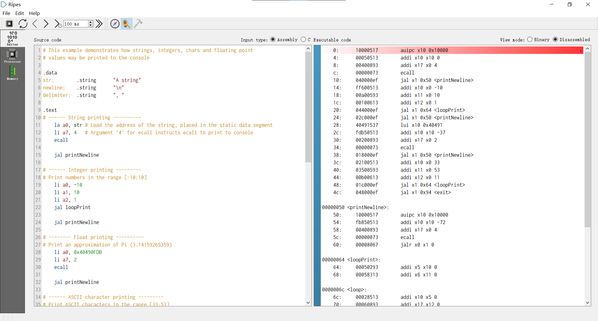

# 计算机组成原理实验 报告

## 实验题目：CPU测试及汇编程序设计

## 学生姓名：Ouedraogo Ezekiel B

## 学生学号：PL19215001

---

### 实验目的

---

* 握CPU下载调试方法，以及测试数据 (COE文件) 的生成方法

* 熟悉汇编程序的基本结构、仿真和调试的基本方法

* 理解机器指令实现的基本原理（数据通路和控制器的协调工作过程）

---

### 实验环境

---

[Ripes](https://github.com/mortbopet/Ripes)

[RARS](https://github.com/TheThirdOne/rars)

---

### 实验步骤

---

1. 仿真RIPES示例汇编程序 (Console Printing)



2. 设计汇编程序，实现人工检查

下面检查 sw, lw, add, addi, beq, jal 六个指令

```nasm
.data
led: .word 0xff 	# all leds on

.text
	la a0, led
main:
	beq x0, x0, test
	jal exit           

test:
	lw a1, 0(a0)       # load 0xff
	
	sw x0, 0(a0) 		# test sw, lw, beq all leds off

	addi t0, x0, 0x1 	# test addi
	sw t0, 0(a0)        # one led on

	add t0, x0, a1      # test add and lw
	sw t0, 0(a0)        # all leds on
	
	jal exit            # test jal

	sw x0, 0(a0) 		# all leds off
	
exit:
```

利用RARS生成coe文件

```coe
ffffd517
00050513
00000463
024000ef
00052583
00052023
00100293
00552023
00b002b3
00552023
008000ef
00052023
```

3. 实现计算斐波那契—卢卡斯数列

```nasm
.data
out: .word 0
in1: .word 1
in2: .word 2

.text
	la a0, out
    lw a1, in1
    lw a2, in2

fibonacci: # a0 --> output a1 --> numb1, a2 --> numb2
    add t0, a1, a2
    sw t0, 0(a0)
    add a1, a2, x0
    add a2, t0, x0
    jal fibonacci
```

利用RARS生成coe文件

```coe
ffffd517
00050513
ffffd597
ffc5a583
00b52023
ffffd617
ff462603
00c52023
00c582b3
00552023
000605b3
00028633
ff1ff0ef
```
