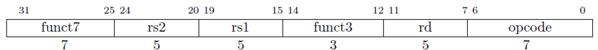
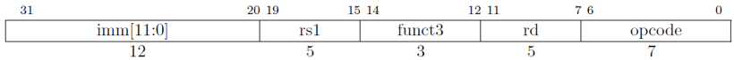
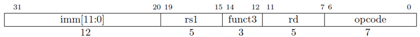
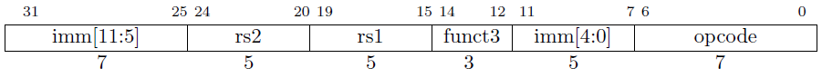
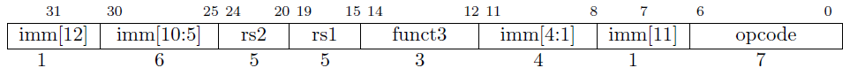
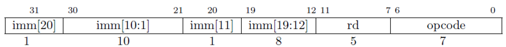
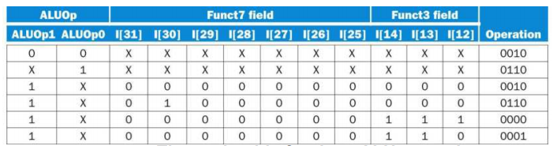
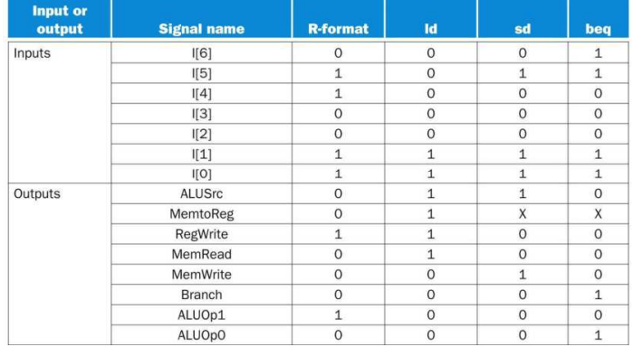
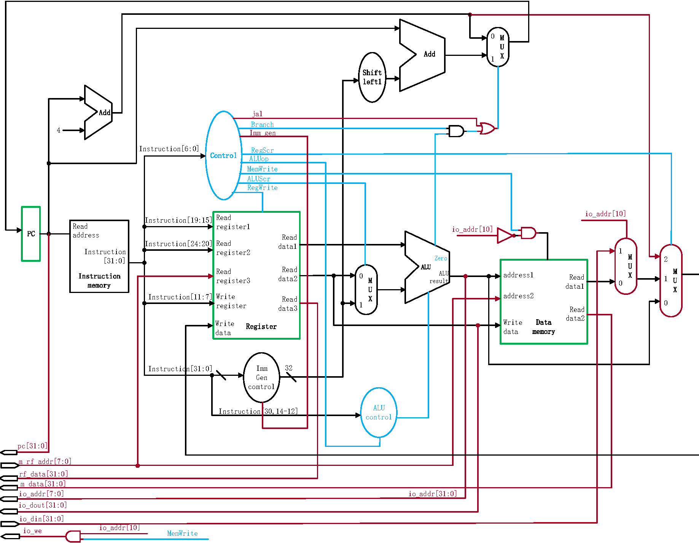
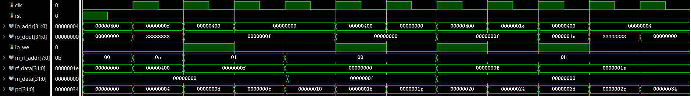

# 计算机组成原理实验 报告

## 实验题目：单周期CPU设计

## 学生姓名：Ouedraogo Ezekiel B

## 学生学号：PL19215001

---

### 实验目的

---

* 理解CPU的结构和工作原理

* 掌握单周期CPU的设计和调试方法

* 熟练掌握数据通路和控制器的设计和描述方法

---

### 实验环境

---

[Online FPGA](https://fpgaol.ustc.edu.cn)

Vivado

[RARS](https://github.com/TheThirdOne/rars)

---

### 实验步骤

---

#### I. 指令

本次实验我们只实现RISC V 中的六个指令。

1. add



* funct7: ```7'b0000000```
* funct3: ```3'b000```
* opcode: ```7'b0110011```

2. addi



* funct3: ```3'b000```
* opcode:```7'b0010011```

3. lw



* funct3: ```3'b010```
* opcode: ```7'b0000011```

4. sw



* funct3: ```3'b010```
* opcode: ```7'b0100011```

5. beq



* funct3: ```3'b000```
* opcode: ```7'b1100011```

6. jal



* opcode: ```7'b1101111```

#### II. CPU 部件设计

1. PC

```verilog
module PC #(parameter MSB = 31, LSB = 0) (
    input clk, rst,
    input [MSB:LSB] in,
    output reg [MSB:LSB] out
    );
    always @(posedge clk or posedge rst) begin
        if(rst) out <= 0;
        else out <= in;
    end
endmodule
```

2. Instruction, Data Memory

利用256x32位分布式存储器。

3. Registers File

```verilog
module RegFile (
    input clk, rst, we,             // write enable
    input [31:0] wd,                // write data
    input [4:0] wa, ra0, ra1, ra2, // write, read address
    output [31:0] rd0, rd1, rd2     // read data
    );
    localparam SIZE = 32; 
    reg [31:0] memory[SIZE-1:0]; 
    
    assign rd0 = memory[ra0];
    assign rd1 = memory[ra1];
    assign rd2 = memory[ra2];

    always @(posedge clk or posedge rst) begin
        if(rst) begin
            memory[0] <= 0;
        end
        else if(wa != 0 & we == 1) begin
            memory[wa] <= wd;
        end
    end
endmodule
```

4. Immediate Generator

见上面的指令图。

```verilog
module Imm (
    input en, // enable
    input [31:0] instr,
    output reg [31:0] out
    );
    always @(*) begin
        if(en) begin
            case (instr[6:0]) // opcode
                7'b1101111: begin // jal
                    out <= { instr[31] == 0 ? 12'h0 : 12'hfff, instr[31], instr[19:12], instr[20], instr[30:21] };
                end
                7'b1100011: begin // beq
                    out <= { instr[31] == 0 ? 12'h0 : 12'hfff, instr[31], instr[7], instr[30:25], instr[11:8] };
                end
                7'b0000011: begin // lw
                    out <= { instr[31:20] };
                end
                7'b0100011: begin // sw
                    out <= { instr[31:25], instr[11:7] };
                end
                7'b0010011: begin // addi
                    out <= { instr[31:20] };
                end
            endcase
        end
    end
endmodule
```

5. ALU

ALU control lines | Function |
---|---|
0000 | AND |
0001 | OR |
0010 | add |
0110 | subtract |
||

```verilog
module ALU #(parameter MSB = 31, LSB = 0, F_MSB = 2, F_LSB = 0) (
    input [MSB:LSB] in0, in1,
    input [F_MSB:F_LSB] op,
    output zero,
    output reg [MSB:LSB] out
    );
    assign zero = (out == 0);
    always @(*) begin
        case (op)
            `AND: out <= in0 & in1;
            `OR: out  <= in0 | in1;
            `ADD: out <= in0 + in1;
            `SUB: out <= in0 - in1;
        endcase
    end
endmodule
```

6. ALU COntrol



```verilog
module ALU_Control (
    input [1:0] ALU_op,
    input [31:0] instr,
    output reg [2:0] op
    );
    wire [2:0] funct3;
    wire [6:0] funct7;

    assign funct3 = instr[14:12];
    assign funct7 = instr[31:25];

    always @* begin
        case (ALU_op)
            2'b00: op <= `ADD;
            2'b01: op <= `SUB;
            2'b10: begin
                case ({funct7, funct3})
                    10'b0000000000: op <= `ADD;
                    10'b0100000000: op <= `SUB;
                    10'b0000000111: op <= `AND;
                    10'b0000000110: op <= `OR; 
                endcase
            end
            2'b11: op <= `SUB;
       endcase 
    end
endmodule
```

7. Control



```verilog
module Control (
    input [6:0] opcode,
    output reg jal, branch, imm_gen, mem_write, alu_src, reg_write,
    output reg [1:0] reg_src, ALU_op
    );
    always @(*) begin
        case (opcode)
            7'b1101111: begin // jal
                { jal, imm_gen } <= 2'b11;
                { mem_write, reg_write } <= 2'b00;
                ALU_op <= 2'b00;
            end
            7'b1100011: begin // beq
                { branch, imm_gen } <= 2'b11;
                { mem_write, alu_src, reg_write } <= 0;
                ALU_op <= 2'b01;
            end
            7'b0000011: begin // lw
                { imm_gen, alu_src, reg_write } <= 3'b111;
                { jal, branch, mem_write } <= 3'b000;
                reg_src <= 2'b01;
                ALU_op <= 2'b00;
            end
            7'b0100011: begin // sw
                { imm_gen, alu_src, mem_write } <= 3'b111;
                { jal, branch, reg_write } <= 3'b000;
                ALU_op <= 2'b00;
            end
            7'b0010011: begin // addi
                { imm_gen, alu_src, reg_write } <= 3'b111;
                { jal, branch, mem_write } <= 3'b000;
                reg_src <= 2'b00;
                ALU_op <= 2'b00;
            end
            7'b0110011: begin // add
                reg_write <= 1;
                { jal, branch, imm_gen, mem_write, alu_src } <= 3'b000;
                reg_src <= 2'b00;
                ALU_op <= 2'b10;
            end
        endcase
    end
endmodule
```

#### III. CPU 设计

根据下面的图将CPU部件连接。



```verilog
module CPU (
    input clk, rst,
    
    //IO_BUS
    output [31:0] io_addr,      // led or seg address
    output [31:0] io_dout,     // data out
    output io_we,
    input [31:0] io_din,       // data in
    
    //Debug_BUS
    input [7:0] m_rf_addr,   // memory or regFile address
    output [31:0] rf_data,   // regfile data out
    output [31:0] m_data,    // memory data out
    output [31:0] pc         // output pc current state
    );
    wire [31:0] add4_out, add_out;
    wire [31:0] pc_mux_out;
    wire [31:0] instr;
    wire [31:0] rd, rs1, rs2;
    wire [31:0] rf_out1, rf_out2;
    wire [31:0] mem_out;
    wire [31:0] imm_out;
    wire jal, branch, imm_gen, mem_write, alu_src, reg_write;
    wire [1:0] reg_src, ALU_op;
    wire [31:0] alu_mux_out;
    wire [31:0] alu_out;
    wire zero;
    wire [31:0] io_mux_out;
    wire [31:0] reg_mux_out;
    wire [2:0] alu_ctrl_out;

    assign io_addr = alu_out;
    assign io_dout = rf_out2;
    assign io_we = mem_write & io_addr[10];

     
    PC PC (
        .clk(clk), .rst(rst),
        .in(pc_mux_out),
        .out(pc)
    );
    
    ADD ADD4(
        .in0(pc), .in1(4),
        .out(add4_out)
    );

    ADD ADD(
        .in0(pc), .in1(imm_out<<1),
        .out(add_out)
    );
    
    MUX2 PC_MUX (
        .in0(add4_out), .in1(add_out),
        .sel((branch & zero) | jal),
        .out(pc_mux_out)
    );

    instr_mem instr_mem(
        .clk(clk), .we(0),
        .a(pc/4),
        .spo(instr)
    );

    Decoder Decoder(
        .instr(instr),      // instruction
        .rd(rd),        // destination
        .rs1(rs1), .rs2(rs2)  // sources
    );
    
    RegFile RegFile (
        .clk(clk), .rst(rst), 
        .we(reg_write),  // write enable
        .wd(reg_mux_out), .wa(rd), 
        .ra0(rs1),     .ra1(rs2),     .ra2(m_rf_addr), // read address
        .rd0(rf_out1), .rd1(rf_out2), .rd2(rf_data)     // read data
    );
    
    Imm Imm(
        .en(imm_gen),
        .instr(instr),
        .out(imm_out)
    );

    Control Control (
        .opcode(instr[6:0]),
        .jal(jal), .branch(branch), .imm_gen(imm_gen), .mem_write(mem_write), .alu_src(alu_src), .reg_write(reg_write),
        .reg_src(reg_src), .ALU_op(ALU_op)
    );

    ALU_Control ALU_Control (
        .ALU_op(ALU_op),
        .instr(instr),
        .op(alu_ctrl_out)
    );

    MUX2 ALU_MUX (
        .in0(rf_out2), .in1(imm_out),
        .sel(alu_src),
        .out(alu_mux_out)
    );
    
    ALU ALU (
        .in0(rf_out1), .in1(alu_mux_out),
        .op(alu_ctrl_out), 
        .out(alu_out),
        .zero(zero)
    );

    data_mem data_mem(
        .clk(clk), .we(~io_addr[10] & mem_write),
        .a(alu_out/4),
        .dpra(m_rf_addr),
        .d(rf_out2),
        .spo(mem_out),
        .dpo(m_data)
    );
    
    MUX2 IO_MUX (
        .in0(mem_out), .in1(io_din),
        .sel(io_addr[10]),
        .out(io_mux_out)
    );

    MUX4 REG_MUX (
        .in0(alu_out), .in1(io_mux_out), .in2(add4_out), 
        .sel(reg_src),
        .out(reg_mux_out)
    );
endmodule
```

其中：

```verilog
module Decoder (
    input  [31:0] instr,          // instruction
    output [31:0] rd,        // destination
    output [31:0] rs1, rs2  // sources
    );
    assign rd     = instr[11:7];
    assign rs1    = instr[19:15];
    assign rs2    = instr[24:20];
endmodule

module ADD #(parameter MSB = 31, LSB = 0) (
    input [MSB:LSB] in0, in1,
    output [MSB:LSB] out
    );
    assign out = in0+in1;
endmodule

module MUX2 #(parameter MSB = 31, LSB = 0) (
    input [MSB:LSB] in0, in1,
    input sel,
    output reg [MSB:LSB] out
    );
    always @(*) begin
        case(sel)
            1'b0: out <= in0;
            1'b1: out <= in1;
        endcase
    end
endmodule

module MUX4 #(parameter MSB = 31, LSB = 0) (
    input [MSB:LSB] in0, in1, in2, in3,
    input [1:0]sel,
    output reg [MSB:LSB] out
    );
    always @(*) begin
        case(sel)
            2'b00: out <= in0;
            2'b01: out <= in1;
            2'b10: out <= in2;
            2'b11: out <= in3;
        endcase
    end
endmodule
```

### IV. 测试结果

为了测试设计的CPU六个指令， 我们利用下面的汇编代码。

```nasm
.text
    # initially all leds are on
	addi a0, x0, 0x400 # out0 (led[4:0]) address
    addi x1, x0, 0xf
	sw x1, 0(a0)       # test addi, sw: 4 leds on (8'b0000_1111)
    sw x1, 0(x0)
main:
	beq x1, x1, test
	jal exit

test:
	sw x0, 0(a0)       # test beq: all leds off

	lw a1, 0(x0)       # load 0xf
	sw a1, 0(a0)       # test: lw: 4 leds on (8'b0000_1111)

	add a1, a1, a1     # a1 = 0xf + 0xf = 0x1e
	sw a1, 0(a0)       # test add: 4 leds on (8'b0001_1110)
	
	jal exit

	sw x0, 0(a0) 		# test jal: all leds off
	
exit:
```

利用 RARS 生成coe文件来初始化指令存储器。

```coe
memory_initialization_radix=16;
memory_initialization_vector=
40000513
00f00093
00152023
00102023
00108463
020000ef
00052023
00002583
00b52023
00b585b3
00b52023
008000ef
00052023
```

仿真结果



最后我们利用了已提供的PDU下载至FPGA测试。


**存储器映射外设端口地址表**


**外设使用说明表**

